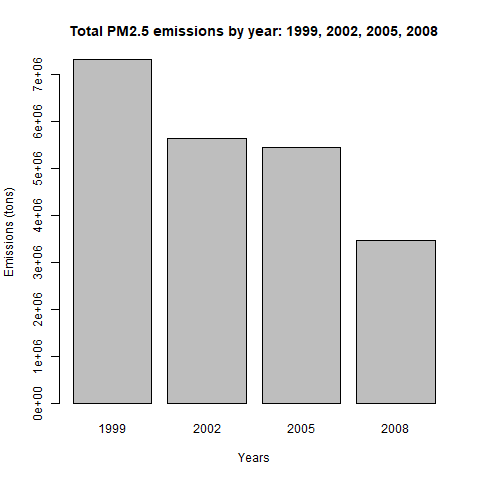
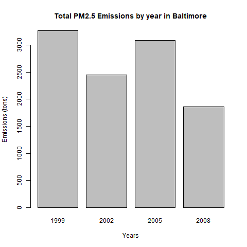
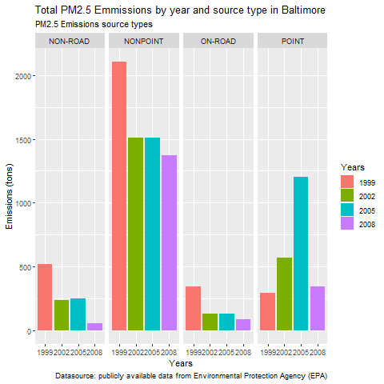
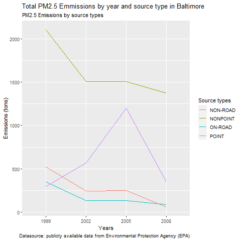
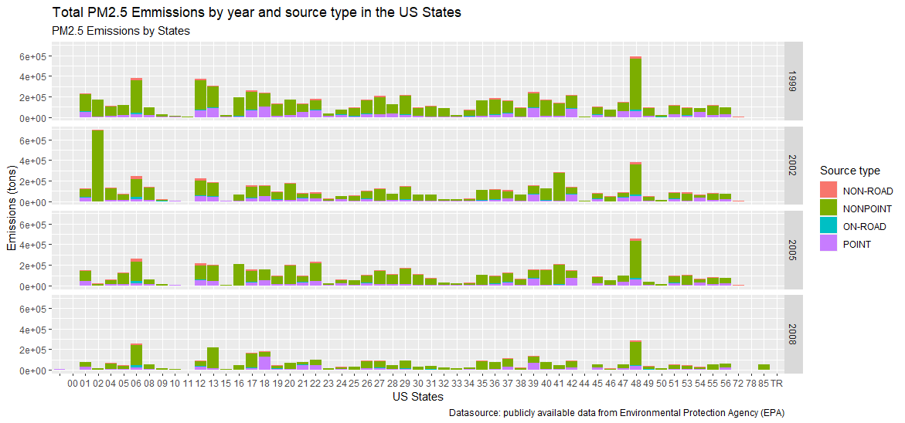
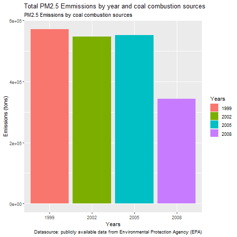
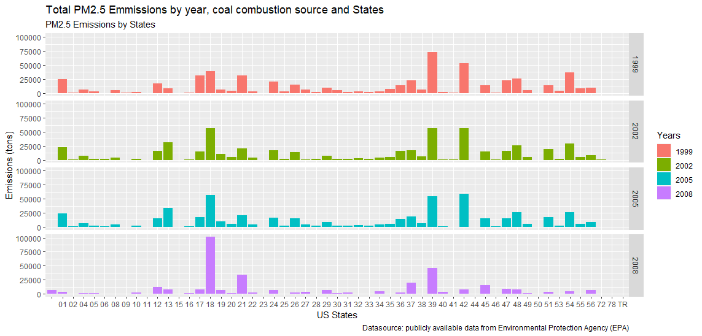
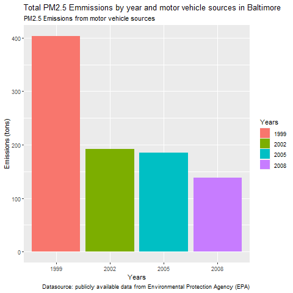
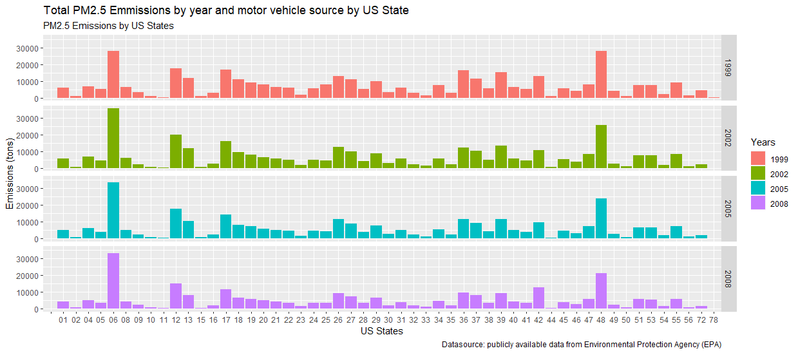
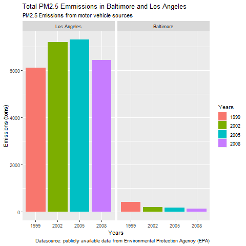

Airquality - US PM2.5 Emissions
================
Exploratory data analysis
31.10.2021

# 1. Intro

Fine particulate matter (PM2.5) is an ambient air pollutant for which
there is strong evidence that it is harmful to human health. In the
United States, the Environmental Protection Agency (EPA) is tasked with
setting national ambient air quality standards for fine PM and for
tracking the emissions of this pollutant into the atmosphere.
Approximately every 3 years, the EPA releases its database on emissions
of PM2.5. This database is known as the National Emissions Inventory
(NEI). You can read more information about the NEI at the EPA National
Emissions Inventory web site.

For each year and for each type of PM source, the NEI records how many
tons of PM2.5 were emitted from that source over the course of the
entire year. The data that you will use for this assignment are for
1999, 2002, 2005, and 2008.

We’ll study data from four years, 1999 (when monitoring of particulate
matter started), 2002, 2005 and 2008. Our goal is to see if there’s been
a noticeable decline in this type of air pollution between these four
years.

# 2. Data

The data used for this exploratory data analysis is available as a
single zip file, from:

-   Data \[29Mb\]:
    <https://d396qusza40orc.cloudfront.net/exdata%2Fdata%2FNEI_data.zip>

Let’s understand the Data.

-   The National Emissions Inventory (NEI) Dataframe

There are 6497651 measurements/observations and 6 features/columns in
the data set. This data frame contains all of the PM2.5 emissions data
for 1999, 2002, 2005, and 2008. For each year, the table contains number
of tons of PM2.5 emitted from a specific type of source for the entire
year. Here are the first few rows.

|     | fips  | SCC      | Pollutant | Emissions | type  | year |
|:----|:------|:---------|:----------|----------:|:------|-----:|
| 4   | 09001 | 10100401 | PM25-PRI  |    15.714 | POINT | 1999 |
| 8   | 09001 | 10100404 | PM25-PRI  |   234.178 | POINT | 1999 |
| 12  | 09001 | 10100501 | PM25-PRI  |     0.128 | POINT | 1999 |
| 16  | 09001 | 10200401 | PM25-PRI  |     2.036 | POINT | 1999 |
| 20  | 09001 | 10200504 | PM25-PRI  |     0.388 | POINT | 1999 |
| 24  | 09001 | 10200602 | PM25-PRI  |     1.490 | POINT | 1999 |

The National Emissions Inventory (NEI) Data

-   Source Classification Code (SCC) Dataframe

There are 11717 measurements/observations and 15 features/columns in the
data set. This table provides a mapping from the SCC digit strings in
the Emissions table to the actual name of the PM2.5 source. The sources
are categorized in a few different ways from more general to more
specific

| SCC      | Data.Category | Short.Name                                                                 | EI.Sector                              | Option.Group | Option.Set |
|:---------|:--------------|:---------------------------------------------------------------------------|:---------------------------------------|:-------------|:-----------|
| 10100101 | Point         | Ext Comb /Electric Gen /Anthracite Coal /Pulverized Coal                   | Fuel Comb - Electric Generation - Coal |              |            |
| 10100102 | Point         | Ext Comb /Electric Gen /Anthracite Coal /Traveling Grate (Overfeed) Stoker | Fuel Comb - Electric Generation - Coal |              |            |
| 10100201 | Point         | Ext Comb /Electric Gen /Bituminous Coal /Pulverized Coal: Wet Bottom       | Fuel Comb - Electric Generation - Coal |              |            |
| 10100202 | Point         | Ext Comb /Electric Gen /Bituminous Coal /Pulverized Coal: Dry Bottom       | Fuel Comb - Electric Generation - Coal |              |            |
| 10100203 | Point         | Ext Comb /Electric Gen /Bituminous Coal /Cyclone Furnace                   | Fuel Comb - Electric Generation - Coal |              |            |
| 10100204 | Point         | Ext Comb /Electric Gen /Bituminous Coal /Spreader Stoker                   | Fuel Comb - Electric Generation - Coal |              |            |

The Source Classification Code (SCC) Data (the first 6 columns)

Emissions Summary

    ##     Min.  1st Qu.   Median     Mean  3rd Qu.     Max. 
    ##      0.0      0.0      0.0      3.4      0.1 646952.0

# 3. CodeBook, Variables

Variables, NEI Dataframe

    ## 'data.frame':    6497651 obs. of  6 variables:
    ##  $ fips     : chr  "09001" "09001" "09001" "09001" ...
    ##  $ SCC      : chr  "10100401" "10100404" "10100501" "10200401" ...
    ##  $ Pollutant: chr  "PM25-PRI" "PM25-PRI" "PM25-PRI" "PM25-PRI" ...
    ##  $ Emissions: num  15.714 234.178 0.128 2.036 0.388 ...
    ##  $ type     : chr  "POINT" "POINT" "POINT" "POINT" ...
    ##  $ year     : int  1999 1999 1999 1999 1999 1999 1999 1999 1999 1999 ...

Table: Variables, NEI Dataframe

\|\| \|\| \|\| \|\| Variables, SCC Dataframe

    ## 'data.frame':    11717 obs. of  15 variables:
    ##  $ SCC                : Factor w/ 11717 levels "10100101","10100102",..: 1 2 3 4 5 6 7 8 9 10 ...
    ##  $ Data.Category      : Factor w/ 6 levels "Biogenic","Event",..: 6 6 6 6 6 6 6 6 6 6 ...
    ##  $ Short.Name         : Factor w/ 11238 levels "","2,4-D Salts and Esters Prod /Process Vents, 2,4-D Recovery: Filtration",..: 3283 3284 3293 3291 3290 3294 3295 3296 3292 3289 ...
    ##  $ EI.Sector          : Factor w/ 59 levels "Agriculture - Crops & Livestock Dust",..: 18 18 18 18 18 18 18 18 18 18 ...
    ##  $ Option.Group       : Factor w/ 25 levels "","C/I Kerosene",..: 1 1 1 1 1 1 1 1 1 1 ...
    ##  $ Option.Set         : Factor w/ 18 levels "","A","B","B1A",..: 1 1 1 1 1 1 1 1 1 1 ...
    ##  $ SCC.Level.One      : Factor w/ 17 levels "Brick Kilns",..: 3 3 3 3 3 3 3 3 3 3 ...
    ##  $ SCC.Level.Two      : Factor w/ 146 levels "","Agricultural Chemicals Production",..: 32 32 32 32 32 32 32 32 32 32 ...
    ##  $ SCC.Level.Three    : Factor w/ 1061 levels "","100% Biosolids (e.g., sewage sludge, manure, mixtures of these matls)",..: 88 88 156 156 156 156 156 156 156 156 ...
    ##  $ SCC.Level.Four     : Factor w/ 6084 levels "","(NH4)2 SO4 Acid Bath System and Evaporator",..: 4455 5583 4466 4458 1341 5246 5584 5983 4461 776 ...
    ##  $ Map.To             : num  NA NA NA NA NA NA NA NA NA NA ...
    ##  $ Last.Inventory.Year: int  NA NA NA NA NA NA NA NA NA NA ...
    ##  $ Created_Date       : Factor w/ 57 levels "","1/27/2000 0:00:00",..: 1 1 1 1 1 1 1 1 1 1 ...
    ##  $ Revised_Date       : Factor w/ 44 levels "","1/27/2000 0:00:00",..: 1 1 1 1 1 1 1 1 1 1 ...
    ##  $ Usage.Notes        : Factor w/ 21 levels ""," ","includes bleaching towers, washer hoods, filtrate tanks, vacuum pump exhausts",..: 1 1 1 1 1 1 1 1 1 1 ...

Table: Variables, SCC Dataframe

\|\| \|\| \|\| \|\|

# 4. Exploratory data analysis

We want to answer some questions about this data.

-   *“Question 1.”* Have total emissions from PM2.5 decreased in the
    United States from 1999 to 2008? Using the base plotting system,
    make a plot showing the total PM2.5 emission from all sources for
    each of the years 1999, 2002, 2005, and 2008.

Total PM2.5 emissions by year: 1999, 2002, 2005, 2008

In this figure (Figure 1) we see that the total emissions from PM2.5
decreased in the United States from 1999 to 2008.

-   *“Question 2.”* Have total emissions from PM2.5 decreased in the
    Baltimore City, Maryland (fips == “24510”) from 1999 to 2008? Use
    the base plotting system to make a plot answering this question.

Total PM2.5 Emissions by year in Baltimore

The total emissions from PM2.5 in the Baltimore City, Maryland decreased
from 1999 to 2002 and from 2005 to 2008. Between 2002 and 2005 they have
been increased. (Figure 2)

-   *“Question 3.”* Of the four types of sources indicated by the type
    (point, nonpoint, onroad, nonroad) variable, which of these four
    sources have seen decreases in emissions from 1999–2008 for
    Baltimore City? Which have seen increases in emissions from
    1999–2008? Use the ggplot2 plotting system to make a plot answer
    this question.

Total PM2.5 Emmissions by year and source type in Baltimore

Here (Figure 3) we can see that the “nonpoint” source type has the
highest total emissions compared to the other ones. The “on-road” and
then the “non-road” emissions are the lowest between the source types.
Overall the emissions from this 3 source types have been decreased
between 1999 and 2008. The “point” source type emissions have strongly
increased between 1999 and 2005 and than strongly decreased until 2008.

Total PM2.5 Emmissions by year and source type in Baltimore

In this figure (Figure 4) we see again a comparison between the
different PM2.5 emission source types. The overall trend shows
decreasing emissions between 1999 and 2008.

Let’s look at the distribution of the PM2.5 emissions from different
source types over the US States between 1999 and 2008. (Figure 5)

Total PM2.5 Emmissions by year and source type in the US States

-   *“Question 4.”* Across the United States, how have emissions from
    coal combustion-related sources changed from 1999–2008?

Total PM2.5 Emmissions by year and coal combustion sources

The PM2.5 emissions from coal combustion sources in US have also
decreased from 1999 to 2008, as seen in the figure above (Figure 6).

Let’s look at the distribution of the PM2.5 emissions from coal
combustion sources over the US States between 1999 and 2008. (Figure 7)

Total PM2.5 Emmissions by year, coal combustion source and US States

-   *“Question 5.”* How have emissions from motor vehicle sources
    changed from 1999–2008 in Baltimore City?

Total PM2.5 Emmissions by year and motor vehicle sources in Baltimore

In this figure (Figure 8) we see that also the emissions from motor
vehicle sources in Baltimore decreased between 1999 and 2008. The
strongest decay is from 1999 to 2002, then there is a light decay until
2008.

Let’s look at the distribution of the PM2.5 emissions from motor vehicle
sources over the US States between 1999 and 2008. (Figure 9)

Total PM2.5 Emmissions by year and motor vehicle source by US State

-   *“Question 6.”* Compare emissions from motor vehicle sources in
    Baltimore City with emissions from motor vehicle sources in Los
    Angeles County, California (fips == “06037”). Which city has seen
    greater changes over time in motor vehicle emissions?

Total PM2.5 Emmissions from motor vehicle sources in Baltimore and LA

In this plot (Figure 10) we have compared the PM2.5 emissions from motor
vehicle source in Baltimore with the emissions in Los Angeles from 1999
to 2008. Los Angeles has a greatest amount of emissions from motor
vehicle over the years than Baltimore. It’s emissions ave increased
until 2005, then they decreased din 2008. Baltimore’s emissions from
motor vehicle sources decreased over the years until 2008.

# 5. Conclusion

We saw here that the total PM2.5 emissions and also emissions from
different sources, coal combustion and motor vehicle or “nonpoint” and
“on-road” sources, have decreased between 1999 and 2008.

# 6. Reference

See Johns Hopkins University, Data Science Specialization, Course
Exploratory Data Analysis, Project 2 Assessment.
